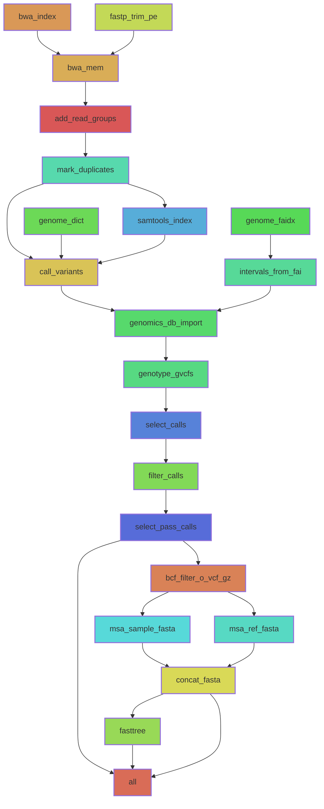

# bwa-gatk-fasttree workflow

This workflow is built by combining in-house bits with
[snakemake-workflows/dna-seq-gatk-variant-calling](https://snakemake.github.io/snakemake-workflow-catalog/docs/workflows/snakemake-workflows/dna-seq-gatk-variant-calling.html#snakemake-workflows-dna-seq-gatk-variant-calling)
and [github.com/stajichlab/PopGenomics_Afumigatus_Global](github.com/stajichlab/PopGenomics_Afumigatus_Global).

The goal is to create a deployable workflow that can be easily adjusted using
configs. In addition, it can be used as base for other extended workflows.

## How to use this workflow

```bash
snakedeploy deploy-workflow https://github.com/b-brankovics/bwa-gatk-fasttree-smkwf . --branch main
# modify config files
snakemake --cores all --sdm conda
```



